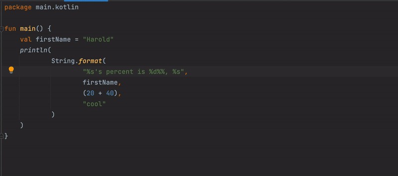

# Replace String.format with Kotlin String Template 

<!-- Plugin description -->
Quickly add named parameters to all callers of a Kotlin class, method or file.

Using it is easy:

1. Place your cursor in a class or function - or in a file with top-level classes or function

2. Search for this action or choose "Replace String.format with Kotlin String Template" from the bottom of the Code menu

3. jk, there is no step 3

<!-- Plugin description end -->

## Installation

- Using IDE built-in plugin system:
  
  <kbd>Settings/Preferences</kbd> > <kbd>Plugins</kbd> > <kbd>Marketplace</kbd> > <kbd>Search for "Replace String.format with Kotlin String Template"</kbd> >
  <kbd>Install Plugin</kbd>
  
- Manually:

  Download the [latest release](https://github.com/hbmartin/intellij-replace-string-format-with-kotlin-template/releases/latest) and install it manually using
  <kbd>Settings/Preferences</kbd> > <kbd>Plugins</kbd> > <kbd>⚙️</kbd> > <kbd>Install plugin from disk...</kbd>

## Contributing

* [PRs](https://github.com/hbmartin/intellij-replace-string-format-with-kotlin-template/pulls) and [bug reports / feature requests](https://github.com/hbmartin/intellij-replace-string-format-with-kotlin-template/issues) are all welcome!
* This project is linted with [ktlint](https://github.com/pinterest/ktlint) via [ktlint-gradle](https://github.com/JLLeitschuh/ktlint-gradle/tags) and statically analyzed with [detekt](https://github.com/detekt/detekt)
* Treat other people with helpfulness, gratitude, and consideration! See the [JetBrains CoC](https://confluence.jetbrains.com/display/ALL/JetBrains+Open+Source+and+Community+Code+of+Conduct)

## Authors

* [Harold Martin](https://www.linkedin.com/in/harold-martin-98526971/) - harold.martin at gmail

